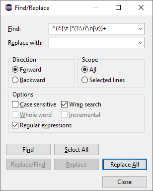

# Build REST services with the OSGi Whiteboard Specification for Jakarta™ RESTful Web Services

Several years ago I wrote a blog post about creating a REST service out of an OSGi service. At that time I used the [OSGi R7 JAX-RS Whiteboard Specification](https://docs.osgi.org/specification/osgi.cmpn/7.0.0/service.jaxrs.html) and the [Aries JAX-RS Whiteboard reference implementation](https://github.com/apache/aries-jax-rs-whiteboard). Since then several things happened:
- The javax to jakarta namespace switch
- [OSGi Compendium Release 8.1](https://docs.osgi.org/specification/osgi.cmpn/8.1.0/) was released
- OSGi projects moved to the Eclipse Foundation

Because of the above reasons, the [OSGi Compendium Release 8.1](https://docs.osgi.org/specification/osgi.cmpn/8.1.0/) contains the [Whiteboard Specification for Jakarta™ RESTful Web Services](https://docs.osgi.org/specification/osgi.cmpn/8.1.0/service.jakartars.html). And additionally the [OSGi Technology Whiteboard Implementation for Jakarta RESTful Web Services](https://github.com/osgi/jakartarest-osgi) reference implementation is available in the Eclipse namespace.

The following tutorial is actually an update to the old one, using the new specification and reference implementation, to be able to create RESTful Web Services using OSGi.

## Create the project structure

Currently there are no Maven archetypes for OSGi that would be really helpful. The enRoute archetypes are outdated and only generate skeletons for OSGi R7 projects. The `org.eclipse.osgitech.rest.archetype` generates the skeleton for a single project, which is helpful to identify the dependencies, but not helpful in a multi-module project.

If you want to try out the `org.eclipse.osgitech.rest.archetype` provided by the reference implementation, you can use the following command:
```
mvn archetype:generate \
-DarchetypeGroupId=org.eclipse.osgi-technology.rest \
-DarchetypeArtifactId=org.eclipse.osgitech.rest.archetype \
-DarchetypeVersion=1.2.2 \
-DgroupId=org.fipro.modifier \
-DartifactId=jakartars \
-Dversion=1.0.0-SNAPSHOT \
-Dpackage=org.fipro.modifier.jakartars
```
As mentioned this creates a single _jakartars_ project. Unfortunately with the above command, the generated project structure is also not valid and shows up with compile errors, as explained in this [GitHub Issue](https://github.com/osgi/jakartarest-osgi/issues/36).

We will not use the mentioned archetype, as we want to build a multi-module project. So let's start to create the project structure using the default Maven archetypes similar to [Multi-Module Project with Maven](https://www.baeldung.com/maven-multi-module):

### Create the parent project

```
mvn archetype:generate \
-DarchetypeArtifactId=maven-archetype-quickstart \
-DgroupId=org.fipro.service.modifier \
-DartifactId=jakartars \
-Dversion=1.0.0-SNAPSHOT \
-DinteractiveMode=false
```

- Switch to the created _jakartars_ folder and 
- Delete the _src_ folder
```
cd jakartars
rmdir src /s ... rm -r src
```

- Open the _pom.xml_ file and set the `packaging` to `pom`

	
### Create the child modules for Service API, Service Implementation, the REST Service and the application

  ```
  mvn archetype:generate \
  -DarchetypeArtifactId=maven-archetype-quickstart \
  -DgroupId=org.fipro.service.modifier \
  -DartifactId=api \
  -Dversion=1.0.0-SNAPSHOT \
  -Dpackage=org.fipro.service.modifier.api \
  -DinteractiveMode=false

  mvn archetype:generate \
  -DarchetypeArtifactId=maven-archetype-quickstart \
  -DgroupId=org.fipro.service.modifier \
  -DartifactId=impl \
  -Dversion=1.0.0-SNAPSHOT \
  -Dpackage=org.fipro.service.modifier.impl \
  -DinteractiveMode=false

  mvn archetype:generate \
  -DarchetypeArtifactId=maven-archetype-quickstart \
  -DgroupId=org.fipro.service.modifier \
  -DartifactId=rest \
  -Dversion=1.0.0-SNAPSHOT \
  -Dpackage=org.fipro.service.modifier.rest \
  -DinteractiveMode=false

  mvn archetype:generate \
  -DarchetypeArtifactId=maven-archetype-quickstart \
  -DgroupId=org.fipro.service.modifier \
  -DartifactId=app \
  -Dversion=1.0.0-SNAPSHOT \
  -Dpackage=org.fipro.service.modifier.app \
  -DinteractiveMode=false
  ```

Now the projects can be imported to the IDE of your choice. As the projects are plain Maven based Java projects, you can use any IDE. But of course my choice is Eclipse with Bndtools.

- Import the created projects via
    _File - Import... - Maven - Existing Maven Projects_
- Select the created _jakartars_ directory


Open the _jakartars/pom.xml_ parent pom file and add the following configurations:

```xml
<properties>
  <java.version>17</java.version>
  <project.build.sourceEncoding>UTF-8</project.build.sourceEncoding>
  <bnd.version>7.0.0</bnd.version>
  <jakartars.whiteboard.version>1.2.2</jakartars.whiteboard.version>
  <jersey.version>3.1.5</jersey.version>
</properties>
```
 
**_Note:_**  
We will use the newest Bndtools 7.0.0 which requires Java 17 for the execution. If you need to use Java 11 in your setup, use Bndtools 6.4.0.

At the time writing this blog post, the current released version of the [`org.eclipse.osgi-technology.rest`](https://central.sonatype.com/search?q=org.eclipse.osgi-technology.rest) artefacts is *1.2.2*. Double check if in the meanwhile a newer version was published. In case you want to test a SNAPSHOT version, you need to add the following snippet to your Maven _settings.xml_:

```xml
<profiles>
	<profile>
		<id>oss-sonatype-snapshots</id>
		<repositories>
			<repository>
				 <id>OSSRH</id>
				 <name>Maven OSSRH Snapshots</name>
				 <url>https://oss.sonatype.org/content/repositories/snapshots/</url>
				 <snapshots>
					 <enabled>true</enabled>
				 </snapshots>
				 <releases>
					 <enabled>true</enabled>
				 </releases>
			</repository>
		</repositories>
	</profile>
</profiles>
<activeProfiles>
	<activeProfile>oss-sonatype-snapshots</activeProfile>
</activeProfiles>
```

**_Note:_**  
On Windows there is some formatting issue when using the archetypes. For every additional module you create, an empty line with some spaces is added between the content lines. If you followed the tutorial and created 5 modules, you will see 5 empty lines between every content line. To clean this up and make the _enroute/pom.xml_ file readable again, you can do a search and replace via regular expression in an editor of your choice. Use the following regex and replace it with nothing

```
^(?:[\t ]*(?:\r?\n|\r))+
```

The following screenshot shows the settings in the _Find/Replace_ dialog that can be used to cleanup:



- Remove the `dependencies` section from the _jakartars/pom.xml_
- Add the `dependencyManagement` and the `build` section similar to the following snippets

<details>
  <summary><code>dependencyManagement</code> section in parent <em>pom.xml</em></summary>

```xml
<dependencyManagement>
  <dependencies>
    <dependency>
      <groupId>org.osgi</groupId>
      <artifactId>osgi.core</artifactId>
      <version>8.0.0</version>
      <scope>provided</scope>
    </dependency>
    <dependency>
      <groupId>org.osgi</groupId>
      <artifactId>osgi.annotation</artifactId>
      <version>8.1.0</version>
      <scope>provided</scope>
    </dependency>

    <!--  The OSGi framework RI is Equinox  -->
    <dependency>
      <groupId>org.eclipse.platform</groupId>
      <artifactId>org.eclipse.osgi</artifactId>
      <version>3.18.600</version>
      <scope>runtime</scope>
    </dependency>

    <!--  Declarative Services  -->
    <dependency>
      <groupId>org.osgi</groupId>
      <artifactId>org.osgi.service.component</artifactId>
      <version>1.5.1</version>
    </dependency>
    <dependency>
      <groupId>org.osgi</groupId>
      <artifactId>org.osgi.service.component.annotations</artifactId>
      <version>1.5.1</version>
      <scope>provided</scope>
    </dependency>
    <dependency>
      <groupId>org.apache.felix</groupId>
      <artifactId>org.apache.felix.scr</artifactId>
      <version>2.2.6</version>
      <scope>runtime</scope>
      <exclusions>
        <exclusion>
          <groupId>org.codehaus.mojo</groupId>
          <artifactId>animal-sniffer-annotations</artifactId>
        </exclusion>
      </exclusions>
    </dependency>

    <!--  Configuration Admin  -->
    <dependency>
      <groupId>org.osgi</groupId>
      <artifactId>org.osgi.service.cm</artifactId>
      <version>1.6.1</version>
    </dependency>
    <dependency>
      <groupId>org.apache.felix</groupId>
      <artifactId>org.apache.felix.configadmin</artifactId>
      <version>1.9.26</version>
      <scope>runtime</scope>
    </dependency>

    <!--  OSGi Configurator  -->
    <dependency>
      <groupId>org.osgi</groupId>
      <artifactId>org.osgi.service.configurator</artifactId>
      <version>1.0.1</version>
      <scope>provided</scope>
    </dependency>
    <dependency>
      <groupId>org.apache.felix</groupId>
      <artifactId>org.apache.felix.configurator</artifactId>
      <version>1.0.18</version>
      <scope>runtime</scope>
    </dependency>
    <dependency>
      <groupId>org.apache.felix</groupId>
      <artifactId>org.apache.felix.cm.json</artifactId>
      <version>2.0.2</version>
      <scope>runtime</scope>
    </dependency>

    <!--  Event Admin  -->
    <dependency>
      <groupId>org.osgi</groupId>
      <artifactId>org.osgi.service.event</artifactId>
      <version>1.4.1</version>
    </dependency>
    <dependency>
      <groupId>org.eclipse.platform</groupId>
      <artifactId>org.eclipse.equinox.event</artifactId>
      <version>1.6.200</version>
      <scope>runtime</scope>
    </dependency>

    <!--  Log Stream Service  -->
    <dependency>
      <groupId>org.osgi</groupId>
      <artifactId>org.osgi.service.log</artifactId>
      <version>1.5.0</version>
      <scope>runtime</scope>
    </dependency>
    <dependency>
      <groupId>org.eclipse.platform</groupId>
      <artifactId>org.eclipse.equinox.log.stream</artifactId>
      <version>1.1.100</version>
      <scope>runtime</scope>
    </dependency>

    <!--  Metatype  -->
    <dependency>
      <groupId>org.osgi</groupId>
      <artifactId>org.osgi.service.metatype</artifactId>
      <version>1.4.1</version>
    </dependency>
    <dependency>
      <groupId>org.osgi</groupId>
      <artifactId>org.osgi.service.metatype.annotations</artifactId>
      <version>1.4.1</version>
    </dependency>
    <dependency>
      <groupId>org.eclipse.platform</groupId>
      <artifactId>org.eclipse.equinox.metatype</artifactId>
      <version>1.6.300</version>
      <scope>runtime</scope>
    </dependency>

    <!--  OSGi Converter  -->
    <dependency>
      <groupId>org.osgi</groupId>
      <artifactId>org.osgi.util.converter</artifactId>
      <version>1.0.9</version>
      <scope>runtime</scope>
    </dependency>

    <!--  OSGi Function  -->
    <dependency>
      <groupId>org.osgi</groupId>
      <artifactId>org.osgi.util.function</artifactId>
      <version>1.2.0</version>
      <scope>runtime</scope>
    </dependency>

    <!--  OSGi Promise  -->
    <dependency>
      <groupId>org.osgi</groupId>
      <artifactId>org.osgi.util.promise</artifactId>
      <version>1.3.0</version>
      <scope>runtime</scope>
    </dependency>

    <!--  OSGi PushStream  -->
    <dependency>
      <groupId>org.osgi</groupId>
      <artifactId>org.osgi.util.pushstream</artifactId>
      <version>1.1.0</version>
      <scope>runtime</scope>
    </dependency>

    <!-- Jakarta Servlet Whiteboard -->
    <dependency>
      <groupId>org.osgi</groupId>
      <artifactId>org.osgi.service.servlet</artifactId>
      <version>2.0.0</version>
    </dependency>

    <!-- Jakarta RESTful Web Services Whiteboard -->
    <dependency>
      <groupId>jakarta.ws.rs</groupId>
      <artifactId>jakarta.ws.rs-api</artifactId>
      <version>3.1.0</version>
      <scope>compile</scope>
    </dependency>
    <dependency>
      <groupId>org.osgi</groupId>
      <artifactId>org.osgi.service.jakartars</artifactId>
      <version>2.0.0</version>
    </dependency>
    <!-- The whiteboard implementation -->
    <dependency>
      <groupId>org.eclipse.osgi-technology.rest</groupId>
      <artifactId>org.eclipse.osgitech.rest</artifactId>
      <version>${jakartars.whiteboard.version}</version>
      <scope>runtime</scope>
    </dependency>
    <!-- The whiteboard implementation default configuration, when you want to use it -->
    <dependency>
      <groupId>org.eclipse.osgi-technology.rest</groupId>
      <artifactId>org.eclipse.osgitech.rest.config</artifactId>
      <version>${jakartars.whiteboard.version}</version>
      <scope>runtime</scope>
    </dependency>
    <!-- An optional fragment for the use of server sent events -->
    <dependency>
      <groupId>org.eclipse.osgi-technology.rest</groupId>
      <artifactId>org.eclipse.osgitech.rest.sse</artifactId>
      <version>${jakartars.whiteboard.version}</version>
      <scope>runtime</scope>
    </dependency>
    <!-- The adapter to run the implementation with Jetty -->
    <dependency>
      <groupId>org.eclipse.osgi-technology.rest</groupId>
      <artifactId>org.eclipse.osgitech.rest.jetty</artifactId>
      <version>${jakartars.whiteboard.version}</version>
      <scope>runtime</scope>
    </dependency>
    <!-- The adapter to run the implementation with the OSGi Servlet Whiteboard -->
    <dependency>
      <groupId>org.eclipse.osgi-technology.rest</groupId>
      <artifactId>org.eclipse.osgitech.rest.servlet.whiteboard</artifactId>
      <version>${jakartars.whiteboard.version}</version>
      <scope>runtime</scope>
    </dependency>

    <!-- Jersey - explicitly added to be able to update the dependency that is provided by org.eclipse.osgi-technology.rest -->
    <dependency>
      <groupId>org.glassfish.jersey</groupId>
      <artifactId>jersey-bom</artifactId>
      <version>${jersey.version}</version>
      <type>pom</type>
      <scope>import</scope>
    </dependency>

    <!-- Condition Service -->
    <dependency>
      <groupId>org.osgi</groupId>
      <artifactId>org.osgi.service.condition</artifactId>
      <version>1.0.0</version>
    </dependency>

    <!-- Tracker -->
    <dependency>
      <groupId>org.osgi</groupId>
      <artifactId>org.osgi.util.tracker</artifactId>
      <version>1.5.4</version>
    </dependency>

    <!--  Jetty  -->
    <dependency>
      <groupId>org.eclipse.jetty</groupId>
      <artifactId>jetty-bom</artifactId>
      <version>11.0.20</version>
      <type>pom</type>
    </dependency>

    <!-- 
      org.apache.felix.http.jetty:
      - implementation of the R8.1 OSGi Servlet Service, the R7 OSGi Http Service and the R7 OSGi Http Whiteboard Specification 
      - has itself the dependencies to Eclipse Jetty, which makes those bundles transitively available in our setup
    -->
    <dependency>
      <groupId>org.apache.felix</groupId>
      <artifactId>org.apache.felix.http.jetty</artifactId>
      <version>5.1.8</version>
      <scope>runtime</scope>
    </dependency>

    <!--  Http Servlet 3.1 API with contract  -->
    <dependency>
      <groupId>org.apache.felix</groupId>
      <artifactId>org.apache.felix.http.servlet-api</artifactId>
      <version>2.1.0</version>
      <!-- <version>3.0.0</version> -->
      <scope>runtime</scope>
    </dependency>

    <!-- Java XML -->
    <dependency>
      <groupId>jakarta.xml.bind</groupId>
      <artifactId>jakarta.xml.bind-api</artifactId>
      <version>4.0.1</version>
    </dependency>
    <dependency>
      <groupId>com.sun.xml.bind</groupId>
      <artifactId>jaxb-osgi</artifactId>
      <version>4.0.4</version>
      <scope>runtime</scope>
    </dependency>

    <!-- JSON Support -->
    <dependency>
      <groupId>jakarta.json</groupId>
      <artifactId>jakarta.json-api</artifactId>
      <version>2.1.3</version>
    </dependency>
    <dependency>
      <groupId>jakarta.json.bind</groupId>
      <artifactId>jakarta.json.bind-api</artifactId>
      <version>3.0.0</version>
    </dependency>
    <dependency>
      <groupId>com.fasterxml.jackson.core</groupId>
      <artifactId>jackson-databind</artifactId>
      <version>2.16.0</version>
    </dependency>
    <dependency>
      <groupId>com.fasterxml.jackson.jakarta.rs</groupId>
      <artifactId>jackson-jakarta-rs-json-provider</artifactId>
      <version>2.16.0</version>
    </dependency>

    <dependency>
      <groupId>org.eclipse.parsson</groupId>
      <artifactId>jakarta.json</artifactId>
      <version>1.1.5</version>
    </dependency>

    <!-- extender that facilitates the use of JRE SPI providers -->
    <dependency>
      <groupId>org.apache.aries.spifly</groupId>
      <artifactId>org.apache.aries.spifly.dynamic.framework.extension</artifactId>
      <version>1.3.7</version>
      <scope>runtime</scope>
    </dependency>
    <dependency>
      <groupId>org.glassfish.hk2</groupId>
      <artifactId>osgi-resource-locator</artifactId>
      <version>1.0.3</version>
      <scope>runtime</scope>
    </dependency>

    <!--  Several implementations need to log using SLF4J  -->
    <dependency>
      <groupId>org.slf4j</groupId>
      <artifactId>slf4j-api</artifactId>
      <version>1.7.36</version>
      <scope>runtime</scope>
    </dependency>
    <dependency>
      <groupId>ch.qos.logback</groupId>
      <artifactId>logback-classic</artifactId>
      <version>1.2.12</version>
      <scope>runtime</scope>
    </dependency>
    <dependency>
      <groupId>ch.qos.logback</groupId>
      <artifactId>logback-core</artifactId>
      <version>1.2.12</version>
      <scope>runtime</scope>
    </dependency>

    <!--  The Web Console  -->
    <dependency>
      <groupId>org.apache.felix</groupId>
      <artifactId>org.apache.felix.webconsole</artifactId>
      <version>4.8.8</version>
      <scope>test</scope>
    </dependency>
    <dependency>
      <groupId>org.apache.felix</groupId>
      <artifactId>org.apache.felix.webconsole.plugins.ds</artifactId>
      <version>2.2.0</version>
      <scope>test</scope>
    </dependency>
    <dependency>
      <groupId>org.apache.felix</groupId>
      <artifactId>org.apache.felix.inventory</artifactId>
      <version>1.1.0</version>
      <scope>test</scope>
    </dependency>

    <!--  The Gogo Shell  -->
    <dependency>
      <groupId>org.apache.felix</groupId>
      <artifactId>org.apache.felix.gogo.shell</artifactId>
      <version>1.1.4</version>
      <scope>test</scope>
    </dependency>
    <dependency>
      <groupId>org.apache.felix</groupId>
      <artifactId>org.apache.felix.gogo.runtime</artifactId>
      <version>1.1.6</version>
      <scope>test</scope>
    </dependency>
    <dependency>
      <groupId>org.apache.felix</groupId>
      <artifactId>org.apache.felix.gogo.command</artifactId>
      <version>1.1.2</version>
      <scope>test</scope>
      <exclusions>
        <exclusion>
          <groupId>org.osgi</groupId>
          <artifactId>org.osgi.core</artifactId>
        </exclusion>
        <exclusion>
          <groupId>org.osgi</groupId>
          <artifactId>org.osgi.compendium</artifactId>
        </exclusion>
      </exclusions>
    </dependency>
  </dependencies>
</dependencyManagement>
```
</details>

<details>
  <summary><code>build</code> section in parent <em>pom.xml</em></summary>

```xml
<build>
  <pluginManagement>
    <plugins>
      <plugin>
        <groupId>org.apache.maven.plugins</groupId>
        <artifactId>maven-compiler-plugin</artifactId>
        <version>3.11.0</version>
        <configuration>
          <release>${java.version}</release>
        </configuration>
      </plugin>

      <!-- Use the bnd-maven-plugin and assemble the symbolic names -->
      <plugin>
        <groupId>biz.aQute.bnd</groupId>
        <artifactId>bnd-maven-plugin</artifactId>
        <version>${bnd.version}</version>
        <configuration>
          <bnd>
            <![CDATA[
Bundle-SymbolicName: ${project.groupId}.${project.artifactId}
-sources: true
-contract: *
]]>
          </bnd>
        </configuration>
        <executions>
          <execution>
            <goals>
              <goal>bnd-process</goal>
            </goals>
          </execution>
        </executions>
      </plugin>
      <!-- Required to make the maven-jar-plugin pick up the bnd 
                  generated manifest. Also avoid packaging empty Jars -->
      <plugin>
        <groupId>org.apache.maven.plugins</groupId>
        <artifactId>maven-jar-plugin</artifactId>
        <version>3.2.0</version>
        <configuration>
          <archive>
            <manifestFile>
              ${project.build.outputDirectory}/META-INF/MANIFEST.MF</manifestFile>
          </archive>
          <skipIfEmpty>true</skipIfEmpty>
        </configuration>
      </plugin>
      <!-- Setup the indexer for running and testing -->
      <plugin>
        <groupId>biz.aQute.bnd</groupId>
        <artifactId>bnd-indexer-maven-plugin</artifactId>
        <version>${bnd.version}</version>
        <configuration>
          <localURLs>REQUIRED</localURLs>
          <attach>false</attach>
        </configuration>
        <executions>
          <execution>
            <id>index</id>
            <goals>
              <goal>index</goal>
            </goals>
            <configuration>
              <indexName>${project.artifactId}</indexName>
            </configuration>
          </execution>
          <execution>
            <id>test-index</id>
            <goals>
              <goal>index</goal>
            </goals>
            <configuration>
              <indexName>${project.artifactId} Test</indexName>
              <outputFile>${project.build.directory}/test-index.xml</outputFile>
              <scopes>
                <scope>test</scope>
              </scopes>
            </configuration>
          </execution>
        </executions>
      </plugin>
      <!-- Define the version of the resolver plugin we use -->
      <plugin>
        <groupId>biz.aQute.bnd</groupId>
        <artifactId>bnd-resolver-maven-plugin</artifactId>
        <version>${bnd.version}</version>
        <configuration>
          <failOnChanges>false</failOnChanges>
          <bndruns></bndruns>
        </configuration>
        <executions>
          <execution>
            <goals>
              <goal>resolve</goal>
            </goals>
          </execution>
        </executions>
      </plugin>
      <!-- Define the version of the export plugin we use -->
      <plugin>
        <groupId>biz.aQute.bnd</groupId>
        <artifactId>bnd-export-maven-plugin</artifactId>
        <version>${bnd.version}</version>
        <configuration>
          <resolve>true</resolve>
          <failOnChanges>false</failOnChanges>
        </configuration>
        <executions>
          <execution>
            <goals>
              <goal>export</goal>
            </goals>
          </execution>
        </executions>
      </plugin>
      <!-- Define the version of the testing plugin that we use -->
      <plugin>
        <groupId>biz.aQute.bnd</groupId>
        <artifactId>bnd-testing-maven-plugin</artifactId>
        <version>${bnd.version}</version>
        <executions>
          <execution>
            <goals>
              <goal>testing</goal>
            </goals>
          </execution>
        </executions>
      </plugin>
      <!-- Define the version of the baseline plugin we use and 
                  avoid failing when no baseline jar exists. (for example before the first 
                  release) -->
      <plugin>
        <groupId>biz.aQute.bnd</groupId>
        <artifactId>bnd-baseline-maven-plugin</artifactId>
        <version>${bnd.version}</version>
        <configuration>
          <failOnMissing>false</failOnMissing>
        </configuration>
        <executions>
          <execution>
            <goals>
              <goal>baseline</goal>
            </goals>
          </execution>
        </executions>
      </plugin>
    </plugins>
  </pluginManagement>
</build>
```
</details>

#### Troubleshooting

- If you face issues with regards to dependency resolution, a good first option to solve is to _Right Click on jakartars - Maven - Update Project..._, select all projects and click _OK_.
- If you see the _Conflicting lifecycle mapping..._ error, you probably have the `bndtools.m2e` connector as well as the `m2e.pde.connector` in your workspace enabled. To solve this open the _pom.xml_  files with the error, set the cursor to the line with the error, press CTRL+1 (Quick Fix) and select **_Ignore M2E PDE Connector..._**

### Service interface

- In the Bndtools Explorer locate the _api_ module
- Open the _pom.xml_ file of the _api_ module and replace the `dependencies` section with the following one:

```xml
<dependencies>
  <dependency>
    <groupId>org.osgi</groupId>
    <artifactId>osgi.core</artifactId>
  </dependency>
  <dependency>
    <groupId>org.osgi</groupId>
    <artifactId>osgi.annotation</artifactId>
  </dependency>
</dependencies>
```
- Add the following `build` section:

```xml
<build>
  <plugins>
    <plugin>
      <groupId>biz.aQute.bnd</groupId>
      <artifactId>bnd-maven-plugin</artifactId>
    </plugin>
    <plugin>
      <groupId>biz.aQute.bnd</groupId>
      <artifactId>bnd-baseline-maven-plugin</artifactId>
    </plugin>
  </plugins>
</build>
```

-  Expand to the package `org.fipro.service.modifier.api`
- Implement the `StringModifier` interface:

```java
public interface StringModifier {
    String modify(String input);
}
```

- You can delete the `App.java` file which was created by the archetype.
- Create the _package-info.java_ file in the `org.fipro.service.modifier.api` package. It configures that the package is exported. If this file is missing, the package is a `Private-Package` and therefore not usable by other OSGi bundles.

```java
@org.osgi.annotation.bundle.Export
@org.osgi.annotation.versioning.Version("1.0.0")
package org.fipro.service.modifier.api;
```

- Delete the package under `src/test/java`

The _package-info.java_ file and its content are part of the Bundle Annotations introduced with R7. Here are some links if you are interested in more detailed information:

- [OSGi R7 Highlights: Bundle Annotations](https://blog.osgi.org/2018/07/osgi-r7-highlights-bundle-annotations.html)
- [Semantic Versioning \| OSGi enRoute](https://enroute.osgi.org/FAQ/210-semantic_versioning.html)
- [OSGi Core Release 8 Framework API](https://docs.osgi.org/specification/osgi.core/8.0.0/framework.api.html#org.osgi.annotation.bundle)


### Service implementation

- In the Bndtools Explorer locate the _impl_ module.
- Open the _pom.xml_ file and add the dependency to the _api_ module in the `dependencies` section.

```xml
<dependency>
  <groupId>org.fipro.service.modifier</groupId>
  <artifactId>api</artifactId>
  <version>${project.version}</version>
</dependency>
```

- Also add the necessary OSGi dependencies:

```xml
<dependency>
  <groupId>org.osgi</groupId>
  <artifactId>osgi.core</artifactId>
</dependency>
<dependency>
  <groupId>org.osgi</groupId>
  <artifactId>osgi.annotation</artifactId>
</dependency>
<dependency>
  <groupId>org.osgi</groupId>
  <artifactId>org.osgi.service.component.annotations</artifactId>
</dependency>
```

- Add the following `build` section:

```xml
<build>
  <plugins>
    <plugin>
      <groupId>biz.aQute.bnd</groupId>
      <artifactId>bnd-maven-plugin</artifactId>
    </plugin>
  </plugins>
</build>
```

- Expand to the package `org.fipro.service.modifier.impl`
- Implement the `StringInverter` service:

```java
@Component
public class StringInverter implements StringModifier {

    @Override
    public String modify(String input) {
        return new StringBuilder(input).reverse().toString();
    }
}
```

- You can delete the `App` class that was created by the archetype.
- Note that the package does not contain a _package-info.java_ file, as the service implementation is typically **NOT** exposed.


## Implementing the REST service / Jakarta REST Web Resource

A [Jakarta RESTful Web Services Resource](https://jakarta.ee/specifications/restful-ws/3.0/jakarta-restful-ws-spec-3.0.html#resources) can be registered with the Jakarta RESTful Web Services Whiteboard by registering them as Whiteboard services. In other words, the Jakarta REST Resource can simply be registered with the Jakarta REST Whiteboard if it is implemented as a OSGi service.

After the projects are imported to the IDE and the OSGi service to consume is available, we can start implementing the REST based service.

- In the Bndtools Explorer locate the _rest_ module.
- Open the _pom.xml_ file and add the dependency to the _api_ module in the `dependencies` section.

```xml
<dependency>
  <groupId>org.fipro.service.modifier</groupId>
  <artifactId>api</artifactId>
  <version>${project.version}</version>
</dependency>
```

- Add the necessary basic OSGi dependencies

```xml
<dependency>
  <groupId>org.osgi</groupId>
  <artifactId>osgi.core</artifactId>
</dependency>
<dependency>
  <groupId>org.osgi</groupId>
  <artifactId>osgi.annotation</artifactId>
</dependency>
<dependency>
  <groupId>org.osgi</groupId>
  <artifactId>org.osgi.service.component.annotations</artifactId>
</dependency>
```

- Add the necessary Jakarta-RS dependencies

```xml
<dependency>
  <groupId>jakarta.ws.rs</groupId>
  <artifactId>jakarta.ws.rs-api</artifactId>
</dependency>
<dependency>
  <groupId>org.osgi</groupId>
  <artifactId>org.osgi.service.jakartars</artifactId>
</dependency>
```

- Add the following `build` section:

```xml
<build>
  <plugins>
    <plugin>
      <groupId>biz.aQute.bnd</groupId>
      <artifactId>bnd-maven-plugin</artifactId>
    </plugin>
  </plugins>
</build>
```

- Expand to the package `org.fipro.service.modifier.rest`
- Implement the `ModifierRestService`:
    - Add the `@Component` annotation to the class definition and specify the _service_ parameter to specify it as a service, not an immediate component.
    - Add the `@JakartarsResource` annotation to the class definition to mark it as a Jakarta-RS whiteboard resource.  
        This will add the service property `osgi.jakartars.resource=true` which means this service must be processed by the Jakarta RS whiteboard. `@JakartarsResource` itself has the `@RequireJakartarsWhiteboard` annotation which adds the requirement for a *Jakarta RESTful Web Services Whiteboard implementation*. Therefore it is not needed to use the `@RequireJakartarsWhiteboard` annotation on your REST service implementation.
    - _Optional:_ Add the `@JakartarsName` annotation.  
    This will add the service property `osgi.jakartars.name`, which defines a user defined name that can be used to identify a Jakarta RESTful Web Services whiteboard service.
    - Add the Jakarta-RS `Path` annotation on class level to specify the URI path that the resource class will serve requests for.
    - Get a `StringModifier` injected using the `@Reference` annotation.
    - Implement a Jakarta-RS resource method that uses the `StringModifier`.

```java
@JakartarsResource
@JakartarsName("modifier")
@Component(service=ModifierRestService.class, scope = ServiceScope.PROTOTYPE)
@Path("/")
public class ModifierRestService {

    @Reference
    StringModifier modifier;

    @GET
    @Path("modify/{input}")
    public String modify(@PathParam("input") String input) {
        return modifier.modify(input);
    }
}
```

#### Interlude: PROTOTYPE Scope

When you read the specification, you will see that the example service is using the PROTOTYPE scope. The example services in the OSGi enRoute tutorials do not use the PROTOTYPE scope. So I was wondering when to use the PROTOTYPE scope for Jakarta-RS Whiteboard services. I was checking the specification and asked on the [OSGi mailing list](https://accounts.eclipse.org/mailing-list/osgi-users). Thanks to [Raymond Augé](https://twitter.com/rotty3000) who helped me understanding it better. In short, if your component implementation is stateless and you get all necessary information injected to the Jakarta-RS resource methods, you can avoid the PROTOTYPE scope. If you have a stateful implementation, that for example gets Jakarta-RS context objects for a request or session injected into a field, you have to use the PROTOTYPE scope to ensure that every information is only used by that single request. The example service in the specification therefore does not need to specify the PROTOTYPE scope, as it is a very simple example. But it is also not wrong to use the PROTOTYPE scope even for simpler services. This aligns the OSGi service design (where typically every component instance is a singleton) with the Jakarta-RS design, as Jakarta-RS natively expects to re-create resources on every request.

## Prepare the application project

There are currently two adapters you can choose from to run the **OSGi Technology Whiteboard Implementation for Jakarta RESTful Web Services**:
- Jetty
- OSGi Servlet Whiteboard (e.g. with Jetty)

### Deployment on Jetty

The following section describes how to run directly on a Jetty server.

In the application project we need to ensure that our service is available. In case the `StringInverter` from above was implemented, the _impl_ module needs to be added to the `dependencies` section of the _app/pom.xml_ file. If you want to use another service that can be consumed via Maven, you of course need to add that dependency.

- In the Bndtools Explorer locate the _app_ module.
- Open the _pom.xml_ file
- Add all dependencies defined in the `dependencyManagement` section of the parent _pom.xml_. Remember to remove the version, as it is defined in the parent _pom.xml_
- Add the dependency to the _impl_ and the _rest_ module in the `dependencies` section.

```xml
<dependency>
  <groupId>org.fipro.service.modifier</groupId>
  <artifactId>impl</artifactId>
  <version>${project.version}</version>
</dependency>
<dependency>
  <groupId>org.fipro.service.modifier</groupId>
  <artifactId>rest</artifactId>
  <version>${project.version}</version>
</dependency>
```
- Check that only the relevant dependencies for the Jetty deployment are included  

```xml
<!-- The whiteboard implementation -->
<dependency>
  <groupId>org.eclipse.osgi-technology.rest</groupId>
  <artifactId>org.eclipse.osgitech.rest</artifactId>
</dependency>
<!-- The whiteboard implementation default configuration, when you want to use it -->
<dependency>
  <groupId>org.eclipse.osgi-technology.rest</groupId>
  <artifactId>org.eclipse.osgitech.rest.config</artifactId>
</dependency>
<!-- An optional fragment for the use of server sent events -->
<dependency>
  <groupId>org.eclipse.osgi-technology.rest</groupId>
  <artifactId>org.eclipse.osgitech.rest.sse</artifactId>
</dependency>
<!-- The adapter to run the implementation with Jetty -->
<dependency>
  <groupId>org.eclipse.osgi-technology.rest</groupId>
  <artifactId>org.eclipse.osgitech.rest.jetty</artifactId>
</dependency>
```
- Add the dependency to `slf4j-simple` to at least see the log statements on the console

```xml
<dependency>
  <groupId>org.slf4j</groupId>
  <artifactId>slf4j-simple</artifactId>
  <version>1.7.36</version>
</dependency>
```

- Add the following `build` section:

```xml
  <build>
    <plugins>
      <plugin>
        <groupId>biz.aQute.bnd</groupId>
        <artifactId>bnd-maven-plugin</artifactId>
      </plugin>
      <plugin>
        <groupId>biz.aQute.bnd</groupId>
        <artifactId>bnd-indexer-maven-plugin</artifactId>
        <configuration>
          <includeJar>true</includeJar>
        </configuration>
      </plugin>
      <plugin>
        <groupId>biz.aQute.bnd</groupId>
        <artifactId>bnd-export-maven-plugin</artifactId>
        <configuration>
          <bndruns>
            <bndrun>app.bndrun</bndrun>
          </bndruns>
        </configuration>
      </plugin>
      <plugin>
        <groupId>biz.aQute.bnd</groupId>
        <artifactId>bnd-resolver-maven-plugin</artifactId>
        <configuration>
          <bndruns>
            <bndrun>app.bndrun</bndrun>
          </bndruns>
        </configuration>
      </plugin>
    </plugins>
  </build>
```

- Remove the `junit` dependency from the _pom.xml_
- Remove _src/test/java_ from the build path via _Right Click -> Build Path -> Remove from Build Path_
- Delete the folder _src/test/java_
- Delete the `App` and the package under _src/main/java_
- Create a folder _src/main/resources/OSGI-INF/configurator_
- Create a _configurator.json_ file in that folder with the following content:

```json
{
  ":configurator:resource-version": 1,
  "JakartarsWhiteboardComponent": {
    "jersey.port": 8080,
    "jersey.jakartars.whiteboard.name" : "Jetty REST",
    "jersey.context.path" : ""
  }
}
```

The following properties are supported for configuring the Whiteboard on Jersey:

| Parameter | Description | Default |
| --- | --- | -- |
|`jersey.schema`| The schema under which the services should be available. | http | 
|`jersey.host`| The host under which the services should be available. | localhost | 
|`jersey.port`| The port  under which the services should be available. | 8181 | 
|`jersey.context.path`| The base context path of the whiteboard. | /rest | 
|`jersey.jakartars.whiteboard.name`| The name of the whiteboard| Jersey REST | 
|`jersey.disable.sessions`| Enable/disable session handling in Jetty.<br>Disabled by default as REST services are stateless. | `true` | 

The definition of these properties is located in [JerseyConstants](https://github.com/osgi/jakartarest-osgi/blob/main/org.eclipse.osgitech.rest/src/main/java/org/eclipse/osgitech/rest/provider/JerseyConstants.java).

**_Note:_**  
The default value for `jersey.context.path` is `/rest`. So if you don't configure a value via the _configurator.json_ file, your services will be available via the `rest` context path. This is also the case for a custom Jakarta-RS application. If you don't want to use a context path, you explicitly have to set it to an empty value, as in the example above.

- Create the folder _config_ in _src/main/java_
- Create a `package-info.java` in the folder _src/main/java/config_ with the following content:

```java
@RequireConfigurator
@RequireConfigurationAdmin
package config;

import org.osgi.service.configurator.annotations.RequireConfigurator;
import org.osgi.service.cm.annotations.RequireConfigurationAdmin;
```

By using these annotations you declare that the **Configurator extender** and a **Configuration Admin implementation** are required. Further information about the Configurator can be found in the [OSGi Compendium Configurator Specification](https://docs.osgi.org/specification/osgi.cmpn/8.1.0/service.configurator.html).

- Create the file _app/app.bndrun_
- Open _app/app.bndrun_
- Switch to the _Source_ tab and add the following content:

```
index: target/index.xml;name="app"

-standalone: ${index}

-runrequires: \
	bnd.identity;id='org.fipro.service.modifier.rest',\
	bnd.identity;id='org.fipro.service.modifier.app',\
	bnd.identity;id='org.eclipse.parsson.jakarta.json',\
	bnd.identity;id='slf4j.simple'
	
-runfw: org.eclipse.osgi
-runee: JavaSE-17
-resolve.effective: active

-runblacklist: bnd.identity;id='org.apache.felix.http.jetty'
```

**_Note:_**  
We add the bundle `org.apache.felix.http.jetty` to the _Run Blacklist_ to avoid that this bundle is used in the resolve process. This is necessary as we explicitly want to use the default Jetty bundles instead of the repackaged Felix Jetty bundle.

- Switch back to the _Run_ tab and click on _Resolve_ 
- Double check that the modules _api_, _app_, _impl_ and _rest_ are part of the _Run Bundles_

**_Note:_**  
If the _Run Bundles_ stay empty, or you see the bundles and shortly afterwards they are gone again, try to set the _Resolution_ to _Auto_ and save the file. This should then solve the issue afterwards.

**_Note:_**  
[Eclipse Parsson](https://projects.eclipse.org/projects/ee4j.parsson) provides an implementation of Jakarta JSON Processing Specification. It is required by the _Jakarta RESTful Web Services implementation_ if you configure it via the [OSGi Compendium Configurator Specification](https://docs.osgi.org/specification/osgi.cmpn/8.1.0/service.configurator.html), but unfortunately there is no direct requirement to an implementation. Therefore it is not resolved automatically and needs to be specified as _Run Requirement_ explicitly.

- Click on _Run OSGi_
- Open a browser and navigate to [http://localhost:8080/modify/fubar](http://localhost:8080/modify/fubar) to see the new REST based service in action.

**_Note:_**  
If you see the following warning and want to get rid of it, you need to add `com.sun.xml.bind.jaxb-osgi` to the _Run Requirements_ and _Resolve_ again.
```
JAXBContext implementation could not be found. WADL feature is disabled.
```

### Deployment on OSGi Servlet Whiteboard

The following section describes how to run using the OSGi Servlet Whiteboard.

If you want to try out both variants, I suggest to create a new module _app-http_. This will be helpful later on to test and compare the differences.
- Switch to the _jakartars_ folder on a console
- Create the child module for the additional application

```
mvn archetype:generate \
-DarchetypeArtifactId=maven-archetype-quickstart \
-DgroupId=org.fipro.service.modifier \
-DartifactId=app-http \
-Dversion=1.0.0-SNAPSHOT \
-Dpackage=org.fipro.service.modifier.app-http \
-DinteractiveMode=false
```

- Import the newly created project via _File - Import... - Maven - Existing Maven Projects_

In the application project we need to ensure that our service is available. In case the `StringInverter` from above was implemented, the _impl_ module needs to be added to the `dependencies` section of the application _pom.xml_ file. If you want to use another service that can be consumed via Maven, you of course need to add that dependency.

- In the Bndtools Explorer locate the _app-http_ module.
- Open the _pom.xml_ file
- Add all dependencies defined in the `dependencyManagement` section of the parent _pom.xml_. Remember to remove the version, as it is defined in the parent _pom.xml_
- Add the dependency to the _impl_ and the _rest_ module in the `dependencies` section.

```xml
<dependency>
  <groupId>org.fipro.service.modifier</groupId>
  <artifactId>impl</artifactId>
  <version>${project.version}</version>
</dependency>
<dependency>
  <groupId>org.fipro.service.modifier</groupId>
  <artifactId>rest</artifactId>
  <version>${project.version}</version>
</dependency>
```

  - Check that only the relevant dependencies for the OSGi Servlet Whiteboard deployment are included

```xml
<!-- The whiteboard implementation -->
<dependency>
  <groupId>org.eclipse.osgi-technology.rest</groupId>
  <artifactId>org.eclipse.osgitech.rest</artifactId>
</dependency>
<!-- The adapter to run the implementation with the OSGi Servlet Whiteboard -->
<dependency>
  <groupId>org.eclipse.osgi-technology.rest</groupId>
  <artifactId>org.eclipse.osgitech.rest.servlet.whiteboard</artifactId>
</dependency>
```

- Add the dependency to `slf4j-simple` to at least see the log statements on the console

```xml
<dependency>
  <groupId>org.slf4j</groupId>
  <artifactId>slf4j-simple</artifactId>
  <version>1.7.36</version>
</dependency>
```

- Add the following `build` section:

```xml
  <build>
    <plugins>
      <plugin>
        <groupId>biz.aQute.bnd</groupId>
        <artifactId>bnd-maven-plugin</artifactId>
      </plugin>
      <plugin>
        <groupId>biz.aQute.bnd</groupId>
        <artifactId>bnd-indexer-maven-plugin</artifactId>
        <configuration>
          <includeJar>true</includeJar>
        </configuration>
      </plugin>
      <plugin>
        <groupId>biz.aQute.bnd</groupId>
        <artifactId>bnd-export-maven-plugin</artifactId>
        <configuration>
          <bndruns>
            <bndrun>app.bndrun</bndrun>
          </bndruns>
        </configuration>
      </plugin>
      <plugin>
        <groupId>biz.aQute.bnd</groupId>
        <artifactId>bnd-resolver-maven-plugin</artifactId>
        <configuration>
          <bndruns>
            <bndrun>app.bndrun</bndrun>
          </bndruns>
        </configuration>
      </plugin>
    </plugins>
  </build>
```

- Remove the `junit` dependency from the _pom.xml_
- Remove _src/test/java_ from the build path via _Right Click -> Build Path -> Remove from Build Path_
- Delete the folder _src/test/java_
- Delete the `App` and the package under _src/main/java_
- Create a folder _src/main/resources/OSGI-INF/configurator_
- Create a _configurator.json_ file in that folder with the following content:

```json
{
  ":configurator:resource-version": 1,
  
  "org.apache.felix.http~modifier":
  {
    "org.osgi.service.http.port": "8080",
    "org.osgi.service.http.host": "localhost",
    "org.apache.felix.http.context_path": "",
    "org.apache.felix.http.name": "Modify REST Service",
    "org.apache.felix.http.runtime.init.id": "modify"
  },
  "JakartarsServletWhiteboardRuntimeComponent~modifier":
  {
    "jersey.context.path" : "",
    "jersey.jakartars.whiteboard.name" : "Servlet REST",
    "osgi.http.whiteboard.target" : "(id=modify)"
  }
}
```

The first block `org.apache.felix.http~modifier` is used to configure the _Apache Felix HTTP Service_ service factory. Details about the configuration options are available in the [Apache Felix HTTP Service Wiki](https://cwiki.apache.org/confluence/display/FELIX/Apache+Felix+HTTP+Service).

The second block `JakartarsServletWhiteboardRuntimeComponent~modifier` is used to configure the whiteboard service factory with the Servlet Whiteboard. The following properties are supported for configuring the Whiteboard on Servlet Whiteboard:

| Parameter | Description | Default |
| --- | --- | -- |
|`jersey.context.path`| The base context path of the whiteboard. | / | 
|`jersey.jakartars.whiteboard.name`| The name of the whiteboard| Jersey REST | 
|`osgi.http.whiteboard.target`| Service property specifying the target filter to select the Http Whiteboard implementation to process the service.<br>The value is an LDAP style filter that points to the id defined in `org.apache.felix.http.runtime.init.id`. | - | 

The definition of these properties is located in [JerseyConstants](https://github.com/osgi/jakartarest-osgi/blob/main/org.eclipse.osgitech.rest/src/main/java/org/eclipse/osgitech/rest/provider/JerseyConstants.java).

- Create the folder _config_ in _src/main/java_
- Create a `package-info.java` in the folder _src/main/java/config_ with the following content:

```java
@RequireConfigurator
@RequireConfigurationAdmin
package config;

import org.osgi.service.configurator.annotations.RequireConfigurator;
import org.osgi.service.cm.annotations.RequireConfigurationAdmin;
```

By using these annotations you declare that the **Configurator extender** and a **Configuration Admin implementation** are required.
Further information about the Configurator can be found in the [OSGi Compendium Configurator Specification](https://docs.osgi.org/specification/osgi.cmpn/8.1.0/service.configurator.html).

- Create the file _app-http/app.bndrun_
- Open _app-http/app.bndrun_
- Switch to the _Source_ tab and add the following content:

```
index: target/index.xml;name="app-http"

-standalone: ${index}

-runrequires: \
	bnd.identity;id='org.fipro.service.modifier.rest',\
	bnd.identity;id='org.fipro.service.modifier.app-http',\
	bnd.identity;id='org.eclipse.parsson.jakarta.json',\
	bnd.identity;id='slf4j.simple',\
	bnd.identity;id='org.apache.felix.http.jetty'

-runfw: org.eclipse.osgi
-runee: JavaSE-17
-resolve.effective: active

# Avoid to have the default Jetty run at port 8080  
-runproperties: \
    org.osgi.service.http.port=-1
```

- Deactivate the HTTP Service under port 8080. This is necessary because the Felix Jetty implementation runs the OSGi HTTP Service by default at port 8080.

```
-runproperties: \
    org.osgi.service.http.port=-1
```

- Switch back to the _Run_ tab
- Click on _Resolve_ and double check that the modules _api_, _app-http_, _impl_ and _rest_ are part of the _Run Bundles_

**_Note:_**  
If the _Run Bundles_ stay empty, or you see the bundles and shortly afterwards they are gone again, try to set the _Resolution_ to _Auto_ and save the file. This should then solve the issue afterwards.

**_Note:_**  
[Eclipse Parsson](https://projects.eclipse.org/projects/ee4j.parsson) provides an implementation of Jakarta JSON Processing Specification. It is required by the _Jakarta RESTful Web Services implementation_ if you configure it via the [OSGi Compendium Configurator Specification](https://docs.osgi.org/specification/osgi.cmpn/8.1.0/service.configurator.html), but unfortunately there is no direct requirement to an implementation. Therefore it is not resolved automatically and needs to be specified as _Run Requirement_ explicitly.

- Click on _Run OSGi_
- Open a browser and navigate to [http://localhost:8080/modify/fubar](http://localhost:8080/modify/fubar) to see the new REST based service in action.

**_Note:_**  
Compared to the Jetty usage, the default value for `jersey.context.path` with the Servlet Whiteboard is `/`. So if you don't want to use a context path, you can simply do not configure a value via the _configurator.json_ file.  

If you specify `org.apache.felix.http.context_path` and `jersey.context.path`, the path to the service is combined, e.g.  
```json
"org.apache.felix.http.context_path": "http"
...
"jersey.context.path" : "demo"
```
Would result in the path **http://localhost:8080/http/demo/modify/fubar**

It is also possible to register the Jakarta-RS Whiteboard Service with the default Jetty. In this case the configuration is much simpler:

```json
{
  ":configurator:resource-version": 1,
  
  "JakartarsServletWhiteboardRuntimeComponent":
  {
    "jersey.jakartars.whiteboard.name" : "Servlet REST",
    "jersey.context.path" : "rest"
  }
}
```

And of course you need to remove `org.osgi.service.http.port=-1` from the `runproperties`, otherwise the default Jetty instance doesn't start. It is important that you provide a configuration, either via Configurator or even manually via ConfigurationAdmin, as the `JakartarsServletWhiteboardRuntimeComponent` requires a configuration.

The following snippet shows how you could provide a configuration programmatically via _Immediate Component_:

```java
@Component
public class JakartaRsConfiguration {

  @Reference
  ConfigurationAdmin admin;
  
  @Activate
  void activate() throws IOException {
    Dictionary<String, String> properties = new Hashtable<>();
    properties.put("jersey.jakartars.whiteboard.name", "Servlet REST");
    properties.put("jersey.context.path", "rest");
 
    Configuration config = 
        admin.getConfiguration("JakartarsServletWhiteboardRuntimeComponent", "?");
    config.update(properties);
  }
}
```

**_Note:_**  
If you see the following warning and want to get rid of it 
```
JAXBContext implementation could not be found. WADL feature is disabled.
```
you need to add `com.sun.xml.bind.jaxb-osgi` to the _Run Requirements_ and _Resolve_ again.

## Jakarta RESTful Web Services Extensions

In Jakarta RESTful Web Services you can add [Providers](https://jakarta.ee/specifications/restful-ws/3.0/jakarta-restful-ws-spec-3.0.html#providers) that are responsible for various cross-cutting concerns such as filtering requests, converting representations into Java objects, mapping exceptions to responses, etc. Such Jakarta RESTful Web Services Extensions can be registered with the Jakarta RESTful Web Services Whiteboard by registering them as Whiteboard services. This is explained in more detail in the [OSGi Compendium Specification Jakarta RESTful Web Services Whiteboard](https://docs.osgi.org/specification/osgi.cmpn/8.1.0/service.jakartars.html#service.jakartars.extension.services).

The following interfaces are supported by the specification:

- `ContainerRequestFilter` and `ContainerResponseFilter` extensions are used to alter the HTTP request and response parameters.
- `ReaderInterceptor` and `WriterInterceptor` extensions are used to alter the incoming or outgoing objects for the call.
- `MessageBodyReader` and `MessageBodyWriter` extensions are used to deserialize/serialize objects to the wire for a given media type, for example application/json.
- `ContextResolver` extensions are used to provide objects for injection into other Jakarta RESTful Web Services resources and extensions.
- `ExceptionMapper` extensions are used to map exceptions thrown by Jakarta RESTful Web Services resources into responses.
- `ParamConverterProvider` extensions are used to map rich parameter types to and from String values.
- `Feature` and `DynamicFeature` extensions are used as a way to register multiple extension types with the Jakarta RESTful Web Services container. Dynamic Features further allow the extensions to be targeted to specific resources within the Jakarta RESTful Web Services container.

For a Jakarta-RS Extension Whiteboard Service, there are basically two important annotations:
- `@JakartarsExtension`  
Mark the service as a Jakarta-RS Whiteboard Extension type that should be processed by the Jakarta-RS Whiteboard.
- `@JakartarsExtensionSelect`  
Express dependencies on one or more extension services. Typically used for extension ordering, as extensions are by default applied to every request and response.

As an example we will implement a `WriterInterceptor`. This tutorial contains further examples in the following chapters.

- Implement a `HtmlWriterInterceptor` class in the _rest_ module
  - Add the `@Component` annotation to the class definition to specify it as a service.
  - Add the `@JakartarsExtension` annotation to the class definition to mark the service as a Jakarta-RS Whiteboard Extension type that should be processed by the Jakarta-RS Whiteboard.
  - Implement the `WriterInterceptor` interface and wrap the String in the entity reference with HTML tags.

```java
@Component
@JakartarsExtension
public class HtmlWriterInterceptor implements WriterInterceptor {

	public void aroundWriteTo(WriterInterceptorContext ctx) 
    		throws WebApplicationException, IOException {
        
    	Object entity = ctx.getEntity();
        
        if (entity instanceof String result) {
        	String html = "<html><head></head><body><ul>";
        	String[] split = result.split(";");
        	for (String string : split) {
        		html += "<li>" + string + "</li>";
			}
        	html += "</ul></body>";
        	ctx.setEntity(html);
        }
        ctx.proceed();
    }
}
```

**_Note:_**  
We use the list markup processing already as a preparation for later steps.

By default Jakarta-RS Extensions are applied to every request and response. In cases where this should be not the case for every Jakarta-RS Resource, but only a subset, it is possible to limit the usage via name binding. Let's evaluate this with the following modifications:

- Implement a [Name Binding Annotation](https://jakarta.ee/specifications/restful-ws/3.0/jakarta-restful-ws-spec-3.0.html#Name_Binding) in the _rest_ module

```java
@Target({ElementType.TYPE, ElementType.METHOD})
@Retention(RetentionPolicy.RUNTIME)
@NameBinding
public @interface HtmlModification{}
```

- Update the `HtmlWriterInterceptor` to add the name binding annotation to the class definition

```java
@Component
@JakartarsExtension
@HtmlModification
public class HtmlWriterInterceptor implements WriterInterceptor { ... }
```

- Update the `ModifierRestService` and add a new resource method that uses the name binding annotation and explicitly returns the media type `text/html`

```java
@JakartarsResource
@JakartarsName("modifier")
@Component(service=ModifierRestService.class, scope = ServiceScope.PROTOTYPE)
@Path("/")
public class ModifierRestService {

    @Reference
    StringModifier modifier;

    @GET
    @Path("modify/{input}")
    public String modify(@PathParam("input") String input) {
        return modifier.modify(input);
    }

    @GET
    @Path("modifyhtml/{input}")
    @Produces(MediaType.TEXT_HTML)
    @HtmlModification
    public String modifyHtml(@PathParam("input") String input) {
        return modifier.modify(input);
    }
}
```

- Start the application again and open the following URLs:
  - [http://localhost:8080/modify/fubar](http://localhost:8080/modify/fubar)  
  Shows only the simple String in the browser.
  - [http://localhost:8080/modifyhtml/fubar](http://localhost:8080/modifyhtml/fubar)  
  Shows the String in a HTML list representation.

## Jakarta RESTful Web Services Application

The Jakarta RESTful Web Services Whiteboard registers a default [Jakarta REST Web Service Application](https://eclipse-ee4j.github.io/jersey.github.io/documentation/latest31x/deployment.html#environmenmt.appmodel) with the name `.default`. Typically it is sufficient to register Jakarta-RS Resources and Jakarta-RS Extensions as Whiteboard Services and implicitly use the default application. There are two use cases where it makes sense to register a Jakarta-RS Application as Whiteboard Service:
- To support the use of legacy Jakarta RESTful Web Services applications
- To provide simple scoping of Jakarta RESTful Web Services resources and extensions within a whiteboard

For a Jakarta-RS Application Whiteboard Service, there are basically two important annotations:
- `@JakartarsApplicationBase`  
Mark the service as a Jakarta-RS Whiteboard Application type that should be processed by the Jakarta-RS Whiteboard. Also defines the URI, relative to the root context of the whiteboard, at which the Application should be registered.
- `@JakartarsApplicationSelect`  
Select the Jakarta RESTful Web Services Application with which this Whiteboard service should be associated.

```java
@JakartarsApplicationBase("mod")
@JakartarsName("modifyApplication")
@Component(service=Application.class)
public class ModifyApplication extends Application { ... }
```

```java
@Component(service=ModifierRestService.class, scope = ServiceScope.PROTOTYPE)
@JakartarsResource
@JakartarsApplicationSelect("(osgi.jakartars.name=modifyApplication)")
@Path("/")
@Produces(MediaType.APPLICATION_JSON)
public class ModifierRestService { ... }
```

If you need to use the `@JakartarsApplicationSelect` annotation on multiple Jakarta-RS Resources and Jakarta-RS Extensions, it is helpful to define a Custom Component Property Annotation.

```java
@ComponentPropertyType
@Retention(RetentionPolicy.CLASS)
@Target(ElementType.TYPE)
public @interface TargetModifyApp {
    String osgi_jakartars_application_select() default "(osgi.jakartars.name=modifyApplication)";
}
```

You can then use the `@TargetModifyApp` annotation instead:

```java
@JakartarsResource
@Component(service=ModifierRestService.class, scope = ServiceScope.PROTOTYPE)
@TargetModifyApp
@Path("/")
@Produces(MediaType.APPLICATION_JSON)
public class ModifierRestService { ... }
```

**_Note:_**  
By default Jakarta-RS Resource Whiteboard Services and Jakarta-RS Extension Whiteboard Services are registered with the `.default` Jakarta-RS Application provided by the Whiteboard implementation. They are not automatically assigned to all published Applications. This means, if you have a custom Application in your runtime and want to add Resources and Extensions to that Application, you need to target them via `@JakartarsApplicationSelect`.

An example to follow is shown later in this tutorial, to have a better idea on how it could look like.

Further information is available in the OSGi Compendium Spec [Registering RESTful Web Service Applications](https://docs.osgi.org/specification/osgi.cmpn/8.1.0/service.jakartars.html#service.jakartars.application.services).

## JSON Support

There are use cases where returning a plain String as result of a web service is not sufficient. In the following section we extend our setup to return the result as JSON. We will use [Jackson](https://github.com/FasterXML/jackson) for this. 

### Update the `ModifierRestService`

First we configure the Jakarta-RS Resource so it produces JSON.

- Add the Jakarta-RS `@Produces(MediaType.APPLICATION_JSON)` annotation to the `ModifierRestService` class definition to specify that JSON responses are created.
- Optional:  
    Get multiple `StringModifier` injected and return a `List` of Strings as a result of the REST resource.

```java
@JakartarsResource
@JakartarsName("modifier")
@Component(service=ModifierRestService.class, scope = ServiceScope.PROTOTYPE)
@Path("/")
@Produces(MediaType.APPLICATION_JSON)
public class ModifierRestService {

  @Reference
  private volatile List<StringModifier> modifier;

  @GET
  @Path("modify/{input}")
  public List<String> modify(@PathParam("input") String input) {
    return modifier.stream()
      .map(mod -> mod.modify(input))
      .collect(Collectors.toList());
  }
    
  @GET
  @Path("modifyhtml/{input}")
  @Produces(MediaType.TEXT_HTML)
  @HtmlModification
  public String modifyHtml(@PathParam("input") String input) {
    return modifier.stream()
      .map(mod -> mod.modify(input))
      .collect(Collectors.joining(";"));
  }
}
```

**_Note:_**  
If you change the return value to `List` without further configuration, you will see an error like this:

```
MessageBodyWriter not found for media type=text/html, type=class java.util.ArrayList, genericType=java.util.List<java.lang.String>
```

- Optional:  
    Implement an additional `StringModifier` in the _impl_ module.

```java
@Component
public class Upper implements StringModifier {

  @Override
  public String modify(String input) {
    return input.toUpperCase();
  }
}
```

### Use the Jersey Jackson JSON Provider

Jersey provides support for common media type representations, e.g. [Jersey - JSON - Jackson (2.x)](https://eclipse-ee4j.github.io/jersey.github.io/documentation/latest31x/media.html#json.jackson). By adding the bundle `org.glassfish.jersey.media.jersey-media-json-jackson` to the runtime, the necessary providers are automatically registered to all Jakarta-RS Applications in the runtime.

- Open the _rest/pom.xml_
- Add the following dependency in the `dependencies` section

```xml
<dependency>
  <groupId>org.glassfish.jersey.media</groupId>
  <artifactId>jersey-media-json-jackson</artifactId>
</dependency>
```

- Open the _app/app.bndrun_
- If you changed the implementation of the `ModifierRestService` to consume a collection of `StringModifier`, you need to add the bundle `org.fipro.service.modifier.impl` explicitly to the _Run Requirements_
- Add the `org.glassfish.jersey.media.jersey-media-json-jackson` bundle to the _Run Requirements_

```
-runrequires: \
	bnd.identity;id='org.fipro.service.modifier.impl',\
	bnd.identity;id='org.fipro.service.modifier.rest',\
	bnd.identity;id='org.fipro.service.modifier.app',\
	bnd.identity;id='org.eclipse.parsson.jakarta.json',\
	bnd.identity;id='slf4j.simple',\
	bnd.identity;id='com.sun.xml.bind.jaxb-osgi',\
	bnd.identity;id='org.glassfish.jersey.media.jersey-media-json-jackson'
  ```
- Click on _Resolve_ to ensure that the Jackson libraries and the _impl_ bundle are part of the _Run Bundles_
- Click on _Run OSGi_
- Open a browser and navigate to [http://localhost:8080/modify/fubar](http://localhost:8080/modify/fubar) to see the updated result.

If you have also created the _app-http_ module, perform the above modifications also in the _app-http/app.bndrun_

```
-runrequires: \
    bnd.identity;id='org.fipro.service.modifier.impl',\
    bnd.identity;id='org.fipro.service.modifier.rest',\
    bnd.identity;id='org.fipro.service.modifier.app-http',\
    bnd.identity;id='org.eclipse.parsson.jakarta.json',\
    bnd.identity;id='slf4j.simple',\
    bnd.identity;id='org.apache.felix.http.jetty',\
    bnd.identity;id='com.sun.xml.bind.jaxb-osgi',\
    bnd.identity;id='org.glassfish.jersey.media.jersey-media-json-jackson'
```  

**_Note_:**  
If the execution of _Resolve_ does not take the new changes into account, you need to execute a Maven build `mvn clean verify`, update the projects via _Right Click -> Maven -> Update Project..._, and then trigger _Resolve_ from the _Bnd Run File Editor_  again.

**_Note_:**  
The `org.glassfish.jersey.jackson.JacksonFeature` is automatically registered with all applications in the server. This way the OSGi requirement on the JSON media type via `osgi.jakartars.media.type=application/json` service property is not satisfied. If you want to use the `org.glassfish.jersey.jackson.JacksonFeature` and use the OSGi capability mechanism, you could register it via Jakarta-RS Feature Whiteboard Extension (see below).

### Use the `JacksonJsonProvider` via Jakarta-RS Feature Whiteboard Extension

A Jakarta RESTful Web Service Feature is a special type of Jakarta RESTful Web Service Provider, that implements the `Feature` interface and can be used to configure a Jakarta-RS implementation. They are useful for grouping sets of properties and providers (including other features) that are logically related and must be enabled as a unit (see [Configurable Types](https://jakarta.ee/specifications/restful-ws/3.0/jakarta-restful-ws-spec-3.0.html#configurable_types)).

- Open the _rest/pom.xml_
- Add the following dependency in the `dependencies` section

```xml
<dependency>
  <groupId>com.fasterxml.jackson.jakarta.rs</groupId>
  <artifactId>jackson-jakarta-rs-json-provider</artifactId>
</dependency>
```

- Implement the `JacksonJsonFeature`:
    - Add the `@Component` annotation to the class definition.
    - Add the `@JakartarsExtension` annotation to the class definition to mark the service as a Jakarta-RS Whiteboard Extension type that should be processed by the Jakarta-RS Whiteboard.
    - Add the `@JakartarsMediaType(APPLICATION_JSON)` annotation to the class definition to mark the component as providing a serializer capable of supporting the named media type, in this case the standard media type for JSON.
    - Register the `com.fasterxml.jackson.jakarta.rs.json.JacksonJsonProvider` in the `configure(FeatureContext)` method.

```java
@Component
@JakartarsExtension
@JakartarsMediaType(MediaType.APPLICATION_JSON)
public class JacksonJsonFeature implements Feature {

  @Override
  public boolean configure(FeatureContext context) {
    context.register(JacksonJsonProvider.class);
    return true;
  }
}
```
- Open the file _app/app.bndrun_
- Remove `org.glassfish.jersey.media.jersey-media-json-jackson` from the _Run Requirements_ 
- Click _Resolve_ and verify that the bundle is not part of the _Run Bundles_ anymore

As our `Feature` provides the capability to support the media type JSON via the `@JakartarsMediaType(APPLICATION_JSON)`, we can configure our service to require that capability via the `@JSONRequired` annotation.

- Add the `@JSONRequired` annotation to the `ModifierRestService` class definition to mark this class to require JSON media type support. In OSGi terms it means that a service is available that provides the service property `osgi.jakartars.media.type=application/json`, which we provided in our custom entity provider via `@JakartarsMediaType(MediaType.APPLICATION_JSON)`. This way our Jakarta REST Resource will only be available if the media type support service is available in the runtime.

```java
@JakartarsResource
@JakartarsName("modifier")
@Component(service = ModifierRestService.class, scope = ServiceScope.PROTOTYPE)
@Path("/")
@Produces(MediaType.APPLICATION_JSON)
@JSONRequired
public class ModifierRestService { ... }
```

### Alternative: Custom Entity Provider

In this section we will implement a [Custom Entity Provider](https://eclipse-ee4j.github.io/jersey.github.io/documentation/latest31x/message-body-workers.html) and use [Jackson](https://github.com/FasterXML/jackson) for this. We will first register it directly as a [Jakarta-RS Whiteboard Extension](https://docs.osgi.org/specification/osgi.cmpn/8.1.0/service.jakartars.html#service.jakartars.extension.services).

- In the Bndtools Explorer locate the _rest_ module.
- Open the _pom.xml_ file and add the dependency to Jackson and to the OSGi Converter in the `dependencies` section.

```xml
<dependency>
  <groupId>org.osgi</groupId>
  <artifactId>org.osgi.util.converter</artifactId>
  <scope>compile</scope>
</dependency>

<dependency>
    <groupId>com.fasterxml.jackson.core</groupId>
    <artifactId>jackson-databind</artifactId>
</dependency>
```

**_Note:_**  
Remember to remove `org.glassfish.jersey.media.jersey-media-json-jackson` from the _Run Requirements_ in the _app/app.bndrun_ and _Resolve_ in case you haven't done so already in a previous section. 

- Implement the `JacksonJsonConverter`:
    - Add the `@Component` annotation to the class definition and specify the `PROTOTYPE` _scope_ parameter to ensure that multiple instances can be requested.
    - Add the `@JakartarsExtension` annotation to the class definition to mark the service as a Jakarta-RS Whiteboard Extension type that should be processed by the Jakarta-RS Whiteboard.
    - Add the `@JakartarsMediaType(APPLICATION_JSON)` annotation to the class definition to mark the component as providing a serializer capable of supporting the named media type, in this case the standard media type for JSON.
    - Add the Jakarta-RS `@Consumes(MediaType.WILDCARD)` annotation, to define the media types the `jakarta.ws.rs.ext.MessageBodyReader` can accept. In this case `*/*` to also support "non-standard" JSON variants as input.
    - Add the Jakarta-RS `@Produces(MediaType.APPLICATION_JSON)` annotation, to define the media type the `jakarta.ws.rs.ext.MessageBodyWriter` can produce. In this case `application/json`.
    - Add the Jakarta-RS `@Provider` annotation, to support automatic discovery of the provider class by the Jakarta-RS runtime.
    - Internally make use of the [OSGi Converter Specification](https://docs.osgi.org/specification/osgi.cmpn/8.1.0/util.converter.html) for the implementation.

```java
package org.fipro.service.modifier.rest;

import java.io.BufferedReader;
import java.io.IOException;
import java.io.InputStream;
import java.io.InputStreamReader;
import java.io.OutputStream;
import java.lang.annotation.Annotation;
import java.lang.reflect.Type;
import java.util.List;

import org.osgi.service.component.annotations.Component;
import org.osgi.service.component.annotations.Reference;
import org.osgi.service.component.annotations.ServiceScope;
import org.osgi.service.jakartars.whiteboard.propertytypes.JakartarsExtension;
import org.osgi.service.jakartars.whiteboard.propertytypes.JakartarsMediaType;
import org.osgi.service.log.Logger;
import org.osgi.service.log.LoggerFactory;
import org.osgi.util.converter.Converter;
import org.osgi.util.converter.ConverterFunction;
import org.osgi.util.converter.Converters;

import com.fasterxml.jackson.core.JsonProcessingException;
import com.fasterxml.jackson.databind.ObjectMapper;

import jakarta.ws.rs.Consumes;
import jakarta.ws.rs.Produces;
import jakarta.ws.rs.WebApplicationException;
import jakarta.ws.rs.core.MediaType;
import jakarta.ws.rs.core.MultivaluedMap;
import jakarta.ws.rs.ext.MessageBodyReader;
import jakarta.ws.rs.ext.MessageBodyWriter;
import jakarta.ws.rs.ext.Provider;

@JakartarsExtension
@JakartarsMediaType(MediaType.APPLICATION_JSON)
@Component(scope = ServiceScope.PROTOTYPE)
@Consumes(MediaType.WILDCARD)
@Produces(MediaType.APPLICATION_JSON)
@Provider
public class JacksonJsonConverter implements MessageBodyReader<Object>, MessageBodyWriter<Object> {

  @Reference(service = LoggerFactory.class)
  private Logger logger;

  private final Converter converter = Converters.newConverterBuilder()
      .rule(String.class, this::toJson)
      .rule(this::toObject)
      .build();

  private ObjectMapper mapper = new ObjectMapper();

  private String toJson(Object value, Type targetType) {
    try {
      return mapper.writeValueAsString(value);
    } catch (JsonProcessingException e) {
      logger.error("error on JSON creation", e);
      return e.getLocalizedMessage();
    }
  }

  private Object toObject(Object o, Type t) {
    try {
      if (List.class.getName().equals(t.getTypeName())) {
	      return this.mapper.readValue((String) o, List.class);
	    }
	    return this.mapper.readValue((String) o, String.class);
    } catch (IOException e) {
	    logger.error("error on JSON parsing", e);
    }
    return ConverterFunction.CANNOT_HANDLE;
  }

  @Override
  public boolean isWriteable(Class<?> c, Type t, Annotation[] a, MediaType mediaType) {

    return MediaType.APPLICATION_JSON_TYPE.isCompatible(mediaType) 
        || mediaType.getSubtype().endsWith("+json");
  }

  @Override
  public boolean isReadable(Class<?> c, Type t, Annotation[] a, MediaType mediaType) {

    return MediaType.APPLICATION_JSON_TYPE.isCompatible(mediaType) 
        || mediaType.getSubtype().endsWith("+json");
  }

  @Override
  public void writeTo(
      Object o, Class<?> type, Type genericType, 
      Annotation[] annotations, MediaType mediaType,
      MultivaluedMap<String, Object> httpHeaders, OutputStream out) 
          throws IOException, WebApplicationException {

    String json = converter.convert(o).to(String.class);
    out.write(json.getBytes());
  }

  @Override
  public Object readFrom(
      Class<Object> type, Type genericType, 
      Annotation[] annotations, MediaType mediaType,
      MultivaluedMap<String, String> httpHeaders, InputStream in) 
          throws IOException, WebApplicationException {

    BufferedReader reader = new BufferedReader(new InputStreamReader(in));
    return converter.convert(reader.readLine()).to(genericType);
  }
}
```

### Register Custom Entity Provider via Jakarta-RS Whiteboard Extension Feature

In the previous section we created a Custom Entity Provider to return the media type JSON as service response. And we registered it via the OSGi Jakarta RESTful Web Service Extension mechanism. Basically this means, the Custom Entity Provider needs to be an OSGi service itself. But what about cases where the Custom Entity Provider already exists and is maintained by a project that is not OSGi aware?  

**_How can you make use of Jakarta Extensions that are not whiteboard enabled?_**

The easiest approach is to create a Jakarta Feature as a Jakarta RESTful Web Service Extension. Similar to what we have done to register the `JacksonJsonProvider` (see above).

To show how this works, modify the `JacksonJsonConverter` so it is no whiteboard service anymore: 
  - Remove the OSGi annotations from the class definition
  - Change the logger from `org.osgi.service.log.Logger` to `org.slf4j.Logger`

```java
@Consumes(MediaType.WILDCARD)
@Produces(MediaType.APPLICATION_JSON)
@Provider
public class JacksonJsonConverter implements MessageBodyReader<Object>, MessageBodyWriter<Object> {

  private Logger logger = LoggerFactory.getLogger(JacksonJsonConverter.class);

  ...
} 
```

You need to add the `slf4j-api` to the `dependencies` of the _rest/pom.xml_ to get rid of the compile errors:
```xml
<dependency>
  <groupId>org.slf4j</groupId>
  <artifactId>slf4j-api</artifactId>
  <scope>compile</scope>
</dependency>
```

- Implement/Update the `JacksonJsonFeature`:
    - Add the `@Component` annotation to the class definition.
    - Add the `@JakartarsExtension` annotation to the class definition to mark the service as a Jakarta-RS Whiteboard Extension type that should be processed by the Jakarta-RS Whiteboard.
    - Add the `@JakartarsMediaType(APPLICATION_JSON)` annotation to the class definition to mark the component as providing a serializer capable of supporting the named media type, in this case the standard media type for JSON.
    - Register the `JacksonJsonConverter` in the `configure(FeatureContext)` method.

```java
@Component
@JakartarsExtension
@JakartarsMediaType(MediaType.APPLICATION_JSON)
public class JacksonJsonFeature implements Feature {

	@Override
	public boolean configure(FeatureContext context) {
		context.register(JacksonJsonConverter.class);
		return true;
	}
}
```

If you start the application again with the `JacksonJsonFeature`, the service should work again as expected.  

### Register Custom Entity Provider via Jakarta-RS Application Whiteboard Service

In case you want to have a more static definition of the Jakarta-RS Resources and Jakarta-RS Extensions, and for example you also want to add Extensions that are not whiteboard enabled, you can also use a custom Jakarta-RS Application and register it as a Whiteboard Service.

- Implement the `ModifyApplication`:
    - Add the `@Component` annotation to the class definition to mark it as an OSGi DS.
    - Add the `@JakartarsApplicationBase` annotation to the class definition to mark the service as a Jakarta-RS Whiteboard Application type that should be processed by the Jakarta-RS Whiteboard. Also defines the URI, relative to the root context of the whiteboard, at which the Application should be registered.
    - Add the `@JakartarsName` annotation to the class definition to specify a user defined name that can be used to identify a Jakarta RESTful Web Services whiteboard service.
    - Return the `JacksonJsonConverter` in the `getClasses()` method.

```java
@JakartarsApplicationBase("mod")
@JakartarsName("modifyApplication")
@Component(service=Application.class)
public class ModifyApplication extends Application {

    @Override
    public Set<Class<?>> getClasses() {
        return Set.of(JacksonJsonConverter.class);
    }
}
```

- Update the `ModifierRestService`
    - Add the `@JakartarsApplicationSelect` annotation to select the Jakarta RESTful Web Services Application with which this Whiteboard service should be associated.
    - Remove the `@JSONRequired` annotation, as the converter does not provide the necessary capability.

```java
@JakartarsResource
@JakartarsName("modifier")
@Component(service = ModifierRestService.class, scope = ServiceScope.PROTOTYPE)
@Path("/")
@Produces(MediaType.APPLICATION_JSON)
@JakartarsApplicationSelect("(osgi.jakartars.name=modifyApplication)")
public class ModifierRestService { ... }
```

- Open the _app/app.bndrun_
- Click on _Run OSGi_
- Open a browser and navigate to [http://localhost:8080/mod/modify/fubar](http://localhost:8080/mod/modify/fubar)

After this change you will notice that the REST resource is not available anymore with the default application. This is because we selected the `modifyApplication` as the application where the resource should be available. To register the resource with the default application and the `modifyApplication`, you can either configure to select all Applications in the whiteboard

```java
@JakartarsApplicationSelect("(osgi.jakartars.name=*)")
```

or provide a LDAP filter that selects the two explicitly

```java
@JakartarsApplicationSelect("(|(osgi.jakartars.name=.default)(osgi.jakartars.name=modifyApplication))")
```

If you need to use the `@JakartarsApplicationSelect` annotation on multiple Jakarta-RS Resources and Jakarta-RS Extensions, it is helpful to define a _Custom Component Property Annotation_.

```java
@ComponentPropertyType
@Retention(RetentionPolicy.CLASS)
@Target(ElementType.TYPE)
public @interface TargetModifyApp {
    String osgi_jakartars_application_select() default "(osgi.jakartars.name=modifyApplication)";
}
```

You can then use the `@TargetModifyApp` instead in the `ModifierRestService`:

```java
@JakartarsResource
@JakartarsName("modifier")
@Component(service = ModifierRestService.class, scope = ServiceScope.PROTOTYPE)
@Path("/")
@Produces(MediaType.APPLICATION_JSON)
@TargetModifyApp
public class ModifierRestService { ... }
```

As you can see, you have multiple ways to register a Jakarta-RS Extension:
- Register directly as whiteboard enabled OSGi Declarative Service  
Very simple in a plain OSGi environment, but requires OSGi dependencies in the Jakarta-RS Provider classes.
- Register via Jakarta-RS Extension Feature Whiteboard Service    
Enables the usage of Jakarta-RS Extensions which are not whiteboard enabled. Good in cases where you might need to target multiple applications, or need a more dynamic approach.
- Register via Jakarta-RS Application Whiteboard Service  
Enables the usage of Jakarta-RS Extensions which are not whiteboard enabled. Good if you have a fixed use case with a number of static extensions that must always be present. 

**_Note:_**  
Many thanks to [Tim Ward](https://twitter.com/TimothyWard) who helped me in understanding the Jakarta RESTful Web Services Whiteboard and especially the Extension mechanisms better!

## Control the JSON output format

With Jackson you can control the format of the JSON structure via an `ObjectMapper`. In case of a Custom Entity Provider like the one above, you are in full control of the `ObjectMapper` instance. To make this more dynamic you could also provide an `ObjectMapper` via dependency injection. For this need a Jakarta Extension `ContextResolver` for an `ObjectMapper`.

To make the effect visible, let's first extend the `ModifierRestService` with a resource method that returns a more complex data structure:

```java
@JakartarsResource
@JakartarsName("modifier")
@Component(service = ModifierRestService.class, scope = ServiceScope.PROTOTYPE)
@Path("/")
@Produces(MediaType.APPLICATION_JSON)
@JakartarsApplicationSelect("(osgi.jakartars.name=*)")
public class ModifierRestService {

    @Reference
    private volatile List<StringModifier> modifier;

    @GET
    @Path("modify/{input}")
    public List<String> modify(@PathParam("input") String input) {
      return modifier.stream()
          .map(mod -> mod.modify(input))
          .collect(Collectors.toList());
  }
    
  @GET
  @Path("modifyhtml/{input}")
  @Produces(MediaType.TEXT_HTML)
  @HtmlModification
  public String modifyHtml(@PathParam("input") String input) {
    return modifier.stream()
        .map(mod -> mod.modify(input))
        .collect(Collectors.joining(";"));
   }

  @GET
  @Path("pretty/{input}")
  public Result pretty(@PathParam("input") String input) {
    List<String> result = modifier.stream()
        .map(mod -> mod.modify(input))
        .collect(Collectors.toList());

    return new Result(input, result);
  }
    
  public static record Result(String input, List<String> result) {};
}
```

- Open the _app/app.bndrun_
- Click on _Run OSGi_
- Open a browser and navigate to [http://localhost:8080/pretty/fubar](http://localhost:8080/pretty/fubar) and you should see the following result:

```
{"input":"fubar","result":["FUBAR","rabuf"]}
```

- Implement a `ContextResolver` for `ObjectMapper` in the _rest_ module
    - Add the `@Component` annotation to the class definition to mark it as an OSGi DS.
    - Add the `@JakartarsExtension` annotation to the class definition to mark the service as a Jakarta-RS Whiteboard Extension type that should be processed by the Jakarta-RS Whiteboard.
    - Add the `@Provider` annotation to mark the implementation of an extension interface that should be discoverable by Jakarta-RS runtime during a provider scanning phase.

```java
@JakartarsExtension
@Component
@Provider
public class CustomObjectMapperProvider implements ContextResolver<ObjectMapper> {

  private ObjectMapper mapper;

  public CustomObjectMapperProvider() {
    this.mapper = new ObjectMapper();
    this.mapper.enable(SerializationFeature.INDENT_OUTPUT);
  }

	public ObjectMapper getContext(Class<?> clazz) {
    return mapper;
  }
}
```

If the Custom Entity Provider `JacksonJsonConverter` is still in place in your setup, you need to modify it to get the `ObjectMapper` injected. This can be done by using the `jakarta.ws.rs.ext.Providers`:

```java
@Consumes(MediaType.WILDCARD)
@Produces(MediaType.APPLICATION_JSON)
@Provider
public class JacksonJsonConverter implements MessageBodyReader<Object>, MessageBodyWriter<Object> {

  private Logger logger = LoggerFactory.getLogger(JacksonJsonConverter.class);

  private final Converter converter = Converters.newConverterBuilder()
      .rule(String.class, this::toJson)
      .rule(this::toObject)
      .build();

  @Context
  private Providers providers;

  private ObjectMapper mapper;

  private ObjectMapper getObjectMapper() {
    if (this.mapper == null) {
	    if (providers != null) {
        this.mapper = providers
            .getContextResolver(ObjectMapper.class, MediaType.APPLICATION_JSON_TYPE)
            .getContext(ObjectMapper.class);
      } else {
        this.mapper = new ObjectMapper();
      }
    }

    return this.mapper;
  }

  private String toJson(Object value, Type targetType) {
    try {
      return getObjectMapper().writeValueAsString(value);
    } catch (JsonProcessingException e) {
      logger.error("error on JSON creation", e);
      return e.getLocalizedMessage();
    }
  }

  private Object toObject(Object o, Type t) {
    try {
      if (List.class.getName().equals(t.getTypeName())) {
        return getObjectMapper().readValue((String) o, List.class);
      }
      return getObjectMapper().readValue((String) o, String.class);
    } catch (IOException e) {
      logger.error("error on JSON parsing", e);
    }
    return ConverterFunction.CANNOT_HANDLE;
  }

  ...

}
```

- Start the application again
- Open a browser and navigate to [http://localhost:8080/pretty/fubar](http://localhost:8080/pretty/fubar). The output should now look like this:

```
{
  "input" : "fubar",
  "result" : [ "FUBAR", "rabuf" ]
}
```

If you also have the custom `Application` deployed, try to navigate to [http://localhost:8080/mod/pretty/fubar](http://localhost:8080/mod/pretty/fubar). Here you will now see an error, because the `ContextResolver` by default is only registered with the `.default` application. This can be solved by either adding the `@JakartaApplicationSelect` annotation to the `CustomObjectMapperProvider`, or simply by adding the class to `ModifyApplication#getClasses()`. If you have a custom `Application`, this is probably the better fitting way of solving this.

```java
@JakartarsApplicationBase("mod")
@JakartarsName("modifyApplication")
@Component(service=Application.class)
public class ModifyApplication extends Application {

    @Override
    public Set<Class<?>> getClasses() {
        return Set.of(
        		CustomObjectMapperProvider.class, 
        		JacksonJsonConverter.class);
    }
}
```

Now also [http://localhost:8080/pretty/fubar](http://localhost:8080/pretty/fubar) should produce the correct output without an error.

As explained before with the Custom Entity Provider, you can register the Jakarta Extension as a Whiteboard Extension as above, or as plain Jakarta Extension via a Feature or an Application. This depends on the use case you want to solve. Also note that the `CustomObjectMapperProvider` registered as Whiteboard Extension Service, is also resolved by the `com.fasterxml.jackson.jakarta.rs.json.JacksonJsonProvider` or the `org.glassfish.jersey.media.jersey-media-json-jackson` module. To verify this, change the `JacksonJsonFeature` back to return the `com.fasterxml.jackson.jakarta.rs.json.JacksonJsonProvider` instead of your custom `JacksonJsonConverter`. Or even disable the `JacksonJsonFeature` and add the `org.glassfish.jersey.media.jersey-media-json-jackson` bundle back to the _Run Requirements_ of the _app_ module.

For simple use cases like the one in this tutorial, registering Jakarta Extensions as a Whiteboard Extension is the easiest approach. In more advanced setups, or if you need to consume Jakarta Extensions that are provided by non-OSGi environments, the usage of a Feature as Whiteboard Extension or a whiteboard enabled Jakarta Application is usually more efficient.

## Multipart file upload

In the past I had to implement file processing services as part of the API. This means you upload a file, process it and download the result. This way you can for example migrate model files to a newer version, perform a static analysis of a model and even transform a model to some executable format and execute the result for simulation scenarios.

Using the Jakarta RESTful Web Service Specification and Jersey as implementation, this becomes quite easy. The multipart support is provided via a Jersey Module.

- Open the _app/pom.xml_
- Add the following dependency in the `dependencies` section

```xml
<dependency>
  <groupId>org.glassfish.jersey.media</groupId>
  <artifactId>jersey-media-multipart</artifactId>
</dependency>
```

**_Note:_**  
From Jersey 3.1.0 on, the `MultiPartFeature` is no longer required to be registered and it is registered automatically. So there is no need for an additional Jakarta-RS Feature or the registration via a Jakarta-RS Application. See [Jersey Documentation - Multipart](https://eclipse-ee4j.github.io/jersey.github.io/documentation/latest31x/media.html#multipart) for further information.

- Update the `ModifierRestService` and add a Resource method that supports a file upload
  - `@Consumes(MediaType.MULTIPART_FORM_DATA)`  
  Specify that this REST resource consumes multipart/form-data.
  - `@Produces(MediaType.TEXT_PLAIN)`  
  Specify that the result is plain text, which is for this use case the easiest way for returning the modified file content.
  - `@FormParam("file")`  
  Specify on the method parameter to receive the form data as `EntityPart`, `InputStream` or `String` data-types, or  a `List<EntityPart>`.

```java
// get the EntityPart and the InputStream form parameter with name "file"
// received by a multipart/form-data POST request
@POST
@Path("modify/upload")
@Consumes(MediaType.MULTIPART_FORM_DATA)
@Produces(MediaType.TEXT_PLAIN)
public Response upload(
    @FormParam("file") EntityPart part,
    @FormParam("file") InputStream input) throws IOException {
  
  
    if (part != null
            && part.getFileName().isPresent()) {

        StringBuilder inputBuilder = new StringBuilder();
        try (InputStream is = input;
                BufferedReader br =
                    new BufferedReader(new InputStreamReader(is))) {

            String line;
            while ((line = br.readLine()) != null) {
                inputBuilder.append(line).append("\n");
            }
        }

        // modify file content
        String inputString = inputBuilder.toString();
        List<String> modified = modifier.stream()
            .map(mod -> mod.modify(inputString))
            .collect(Collectors.toList());

        String resultString = part.getFileName().get() + "\n\n";
        resultString += String.join("\n", modified);
        
        return Response.ok(resultString).build();
    }

    return Response.status(Status.PRECONDITION_FAILED).build();
}
```

- Open the _app/app.bndrun_
- Add the `org.glassfish.jersey.media.jersey-media-multipart` bundle to the _Run Requirements_

```
-runrequires: \
	bnd.identity;id='org.fipro.service.modifier.impl',\
	bnd.identity;id='org.fipro.service.modifier.rest',\
	bnd.identity;id='org.fipro.service.modifier.app',\
	bnd.identity;id='org.eclipse.parsson.jakarta.json',\
	bnd.identity;id='slf4j.simple',\
	bnd.identity;id='com.sun.xml.bind.jaxb-osgi',\
	bnd.identity;id='org.glassfish.jersey.media.jersey-media-multipart'
```
- Click on _Resolve_ to ensure that the Jackson libraries are part of the _Run Bundles_
- Click on _Run OSGi_

If you are using a tool like Postman, you can test if the multipart upload is working by executing a POST request on http://localhost:8080/modify/upload
- On the _Body_ tab, select _form-data_
- Set the _Key_ to `file` and check that it is a _File_ and not a _Text_
- Select a text file to upload as _Value_

**_Note:_**  
To return a file instead of plain text, you can return an `EntityPart` and change the `@Produces` annotation to return `MediaType.MULTIPART_FORM_DATA`.

```java
@POST
@Path("modify/change")
@Consumes(MediaType.MULTIPART_FORM_DATA)
@Produces(MediaType.MULTIPART_FORM_DATA)
public Response change(
    @FormParam("file") EntityPart part,
    @FormParam("file") InputStream input) throws IOException {
  
  
  if (part != null
      && part.getFileName().isPresent()) {
    
    StringBuilder inputBuilder = new StringBuilder();
    try (InputStream is = input;
        BufferedReader br =
            new BufferedReader(new InputStreamReader(is))) {
      
      String line;
      while ((line = br.readLine()) != null) {
        inputBuilder.append(line).append("\n");
      }
    }
    
    // modify file content
    String inputString = inputBuilder.toString();
    List<String> modified = modifier.stream()
        .map(mod -> mod.modify(inputString))
        .collect(Collectors.toList());
    
    String resultString = String.join("\n", modified);
    
    return Response
        .ok(EntityPart
            .withFileName("changed.txt")
            .content(resultString)
            .build())
        .build();
  }
  
  return Response.status(Status.PRECONDITION_FAILED).build();
}
```

### Interlude: Static Resources

If you asked yourself before, when to use a deployment on Jetty and when to use the OSGi Servlet Whiteboard, you get an answer in this part of the tutorial. We will publish a simple form as a static resource in our application. Doing this we are able to test the file upload even without additional tools.

To register a HTML form as static resource with our REST service, we use the [Whiteboard Specification for Jakarta™ Servlet](https://docs.osgi.org/specification/osgi.cmpn/8.1.0/service.servlet.html) (formerly known as _Http Whiteboard Specification_).

- Open the _rest/pom.xml_
- Add the following dependency in the `dependencies` section
```xml
<dependency>
  <groupId>org.osgi</groupId>
  <artifactId>org.osgi.service.servlet</artifactId>
</dependency>
```

- Add the `@HttpWhiteboardResource` annotation to the `ModifierRestService` class definition

```java
@JakartarsResource
@JakartarsName("modifier")
@Component(service = ModifierRestService.class, scope = ServiceScope.PROTOTYPE)
@Path("/")
@Produces(MediaType.APPLICATION_JSON)
@JakartarsApplicationSelect("(osgi.jakartars.name=*)")
@HttpWhiteboardResource(pattern = "/files/*", prefix = "static")
public class ModifierRestService { ... }
```

**_Important:_**  
Once you add the `@HttpWhiteboardResource` annotation, your application won't be able to resolve anymore with the deployment on Jetty setup. The reason is that the `@HttpWhiteboardResource` annotation itself uses the `@RequireHttpWhiteboard`, which means, an implementation of the _Jakarta Servlet Whiteboard_ is required. Either replace the annotation with the corresponding _Component Properties_ to avoid the additional requirement (see below), or ensure to run the example on the _OSGi Jakarta Servlet Whiteboard_.

```java
@JakartarsResource
@JakartarsName("modifier")
@Component(
    service = ModifierRestService.class, 
    scope = ServiceScope.PROTOTYPE,
    // use component properties instead of component property type annotation
    // this way we avoid the requirement on the Servlet Whiteboard and the service also works on a Jetty
    property = {
        "osgi.http.whiteboard.resource.pattern=/files/*",
        "osgi.http.whiteboard.resource.prefix=static"
    })
@Path("/")
@Produces(MediaType.APPLICATION_JSON)
@JakartarsApplicationSelect("(osgi.jakartars.name=*)")
public class ModifierRestService { ... }
```

With this configuration all requests to URLs with the `/files` path are mapped to resources in the `static` folder. The next step is therefore to add the static form to the project:

- In the Bndtools Explorer locate the _rest_ module.
- _Right click src/main/java - New - Folder_
- Select the _main_ folder in the tree
- Add _resources/static_ in the _Folder name_ field
- _Finish_
- Ensure that the _resources_ folder is configured as source folder. If not:
  - _Right click_ on the created _resources_ folder in the Bndtools Explorer
  - _Build Path - Use as Source Folder_
- Create a new file _upload.html_ in _scr/main/resources/static_

```html
<html>
<body>
    <h1>File Upload to Jakarta RESTful Web Service</h1>
    <form
        action="http://localhost:8080/modify/upload"
        method="post"
        enctype="multipart/form-data">

        <p>
            Select a file : <input type="file" name="file" size="45"/>
        </p>

        <input type="submit" value="Upload It"/>
    </form>
</body>
</html>
```

- Open the _app-http/app.bndrun_
- _Resolve_ again to reflect the latest changes to the _Run Bundles_

After starting the app via _app-http/app.bndrun_ you can open a browser and navigate to [http://localhost:8080/files/upload.html](http://localhost:8080/files/upload.html). If you decided to modify the _app_ project for deployment via OSGi Servlet Whiteboard, you of course need to start the application via _app/app.bndrun_.
Now you can select a file (don't use a binary file) and upload it to see the modification result of the REST service.

## Debugging / Inspection

To debug your REST based service you can start the application by using _Debug OSGi_ instead of _Run OSGi_ in the _app.bndrun_. But in the OSGi context you often face issues even before you can debug code. In such situations you usually use an OSGi console to inspect the runtime. There are two types of OSGi consoles to inspect the OSGi runtime provided by Apache Felix:

- [Apache Felix Gogo Shell](https://felix.apache.org/documentation/subprojects/apache-felix-gogo.html)
- [Apache Felix Webconsole](https://felix.apache.org/documentation/subprojects/apache-felix-web-console.html)

**_Note:_**  
The Webconsole only works on a deployment via OSGi Servlet Whiteboard. An alternative for OSGi Runtime Inspection would be [OSGi.fx](http://osgifx.com/), which I plan to cover in an upcoming blog post.

To clearly separate the target application runtime from a debug runtime, it is best practice to create an additional _.bndrun_ file. This file includes the _app.bndrun_ and extends it with configurations to enable the inspection capabilities.

- Locate the _app_ project in the _Bndtools Explorer_
- Create a new file _debug.bndrun_ next to the _app.bndrun_ file and add the following content in the _Source_ tab

```
-include: ~app.bndrun

test-index: target/test-index.xml;name="app Test"

-standalone: ${index},${test-index}

-runproperties: \
    osgi.console=,\
    osgi.console.enable.builtin=false

-runrequires.debug: osgi.identity;filter:='(osgi.identity=org.apache.felix.gogo.shell)',\
 osgi.identity;filter:='(osgi.identity=org.apache.felix.gogo.runtime)',\
 osgi.identity;filter:='(osgi.identity=org.apache.felix.gogo.command)'

-resolve: manual
```

The `-runproperties` configuration will start the console in interactive mode. The `-runrequires.debug` configuration adds the necessary console bundles to the runtime. 

- Switch to the _Run_ tab
- Click on _Resolve_
- Click on _Run OSGi_

The Gogo Shell becomes available in the _Console View_ of the IDE. You can now interact with the runtime in the _Console View_, e.g. list all bundles in the runtime via

```console
lb
```

As mentioned before, with the OSGi Jakarta Servlet Whiteboard, you also have the option to use the Felix Webconsole. To demonstrate this, we create a debug configuration in the _app-http_ module.

- Locate the _app-http_ project in the _Bndtools Explorer_
- Create a new file _debug.bndrun_ next to the _app.bndrun_ file and add the following content in the _Source_ tab

```
-include: ~app.bndrun

test-index: target/test-index.xml;name="app Test"

-standalone: ${index},${test-index}

-runproperties: \
    osgi.console=,\
    osgi.console.enable.builtin=false,\
    org.osgi.service.http.port=-1

-runrequires.debug: osgi.identity;filter:='(osgi.identity=org.apache.felix.webconsole)',\
 osgi.identity;filter:='(osgi.identity=org.apache.felix.webconsole.plugins.ds)',\
 osgi.identity;filter:='(osgi.identity=org.apache.felix.gogo.shell)',\
 osgi.identity;filter:='(osgi.identity=org.apache.felix.gogo.runtime)',\
 osgi.identity;filter:='(osgi.identity=org.apache.felix.gogo.command)'

-resolve: manual
```

Compared to the _app/debug.bndrun_ file, we include the Felix Webconsole bundles and ensure that the default Jetty in the Felix Jetty bundle is not started.

- Switch to the _Run_ tab
- Click on _Resolve_
- Click on _Run OSGi_

Now you can open a browser and navigate to [http://localhost:8080/system/console](http://localhost:8080/system/console). Login with the default username/password _admin/admin_. Using the Webconsole you can check which bundles are installed and in which state they are. You can also inspect the available OSGi DS Components and check the active configurations.

## Build

As the project setup is a plain Java/Maven project, the build is pretty easy:

- In the Bndtools Explorer locate the _jakartars_ module (the top level project).
- _Right click - Run As - Maven build..._
- Enter `clean verify` in the _Goals_ field
- _Run_

From the command line:

- Switch to the _jakartars_ directory that was created by the archetype
- Execute `mvn clean verify`

**Note:**  
It can happen that an error occurs on building the _app_ module if you followed the steps in this tutorial exactly. The reason is that the build locates a change in the _Run Bundles_ of the _app.bndrun_ file. But it is just a difference in the ordering of the bundles. To solve this open the _app.bndrun_ file, remove all entries from the _Run Bundles_ and hit _Resolve_ again. After that the order of the _Run Bundles_ will be the same as the one in the build. This could be also avoided by configuring the `bnd-export-maven-plugin` setting the `failOnChanges` parameter to `false`.

**Note:**  
This build process works because we used the Eclipse IDE with Bndtools. If you are using another IDE or working only on the command line, have a look at the [OSGi enRoute Microservices Tutorial](https://enroute.osgi.org/tutorial/030-tutorial_microservice.html) that explains the separate steps for building from command line.

After the build succeeds you will find the resulting `app.jar` in _jakartars/app/target_. Execute the following line to start the self-executable jar from the command line if you are located in the _jakartars_ folder:

```console
java -jar app/target/app.jar
```

If you also want to build the debug configuration, you need to enable this in the _pom.xml_ file of the _app_ and/or the _app-http_ module:

- In the Bndtools Explorer locate the _app_ / _app-http_ module.
- Open _pom.xml_
- In the `build/plugins` section update the `bnd-resolver-maven-plugin` and the `bnd-export-maven-plugin` and add the _debug.bndrun_ to the `bndruns`.

```xml
<plugin>
  <groupId>biz.aQute.bnd</groupId>
  <artifactId>bnd-export-maven-plugin</artifactId>
  <configuration>
    <bndruns>
      <bndrun>app.bndrun</bndrun>
      <bndrun>debug.bndrun</bndrun>
    </bndruns>
  </configuration>
</plugin>
<plugin>
  <groupId>biz.aQute.bnd</groupId>
  <artifactId>bnd-resolver-maven-plugin</artifactId>
  <configuration>
    <bndruns>
      <bndrun>app.bndrun</bndrun>
      <bndrun>debug.bndrun</bndrun>
    </bndruns>
  </configuration>
</plugin>
```

Executing the build again, you will now also find a `debug.jar` in the target folder of the _app_ module, you can use to inspect the OSGi runtime.

## Summary

Implementing Jakarta™ RESTful Web Services with the OSGi Compendium Specification Release 8.1 and the corresponding reference implemenations is similar to approaches with other frameworks like Spring Boot, Quarkus or Microprofile. And if you want to wrap existing OSGi services, it is definitely the most comfortable one. If consuming OSGi services is not needed, well then every framework has its pros and cons.

With this tutorial I hope I can help developers to get started with the OSGi Jakarta™ RESTful Web Services Whiteboard and getting a better understanding of the mechanisms. Writing it at least helped me a lot in that area.

## Further information:
- [Jakarta RESTful Web Services 3.0 Specification](https://jakarta.ee/specifications/restful-ws/3.0/jakarta-restful-ws-spec-3.0.html)
- [Whiteboard Specification for Jakarta™ RESTful Web Services](https://docs.osgi.org/specification/osgi.cmpn/8.1.0/service.jakartars.html)
- [OSGi Technology Whiteboard Implementation for Jakarta RESTful Web Services](https://github.com/osgi/jakartarest-osgi)
- [Jersey 3.1.5 User Guide](https://eclipse-ee4j.github.io/jersey.github.io/documentation/latest31x/index.html)
- [Jackson](https://github.com/FasterXML/jackson)
- [Example Sources on GitHub](https://github.com/fipro78/osgi-jakartars)
